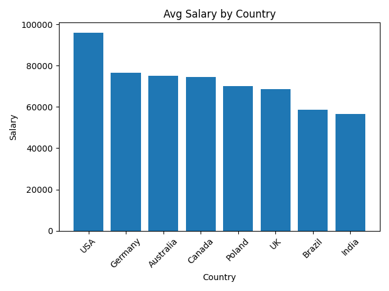
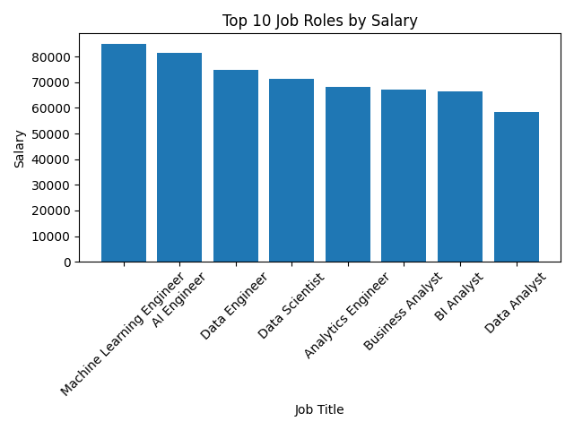
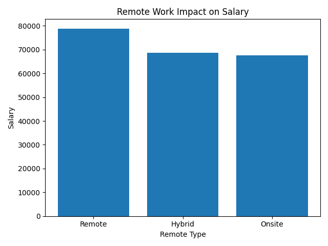

# Global Data Science Salary Analysis
> END TO END DATA ANALYTICS PROJECT USING PYTHON,SQL,MYSQL,EDA
> STATISTICAL TESTING AND DATA VISUALIZATION ON A CUSTOM SYNTHETIC DATASET.

## Project Overview
This project analyzes What factors drive data science salary globally across countries ,job roles
experience level company sizes and remote work types.
unlike most salary projects that use pre built kaggle datasets, this project uses a custom synthetic 
dataset generated using python faker library designed to stimulate realistic global salary distribution
with controlled variability.

> Key Questions Answered 
- Which countries pay the highest Data Science salaries?
- Do remote workers earn more than on-site employees?
- How does experience level affect salary growth?
- Which job roles command the highest compensation?
- Is the salary difference between company sizes statistically significant?

## Key Insights

- ML Engineers and AI ENGINEERS  receive highest  average salary  84k - 81k/year.
- USA and Germany show highest salary trend, led  with averages of $96k- $76k. 
- Remote employees earn highest average salaries compared to onsite employess, earned 78874k on average than  on-site        employees 
- LEAD roles earned approximetely 92562 USD and  entry-level roles 39523 USD.
- Large companies offer higher salaries 77,543 USD salaries and   small companies 66625 USD

## Business Recommendations

1. For Job Seekers: Prioritize remote-first companies — the salary premium is 
   real and statistically proven in this analysis.
2. For Companies: To attract ML/AI talent, compensation benchmarks must account 
   for global competition, especially from US-based remote roles.
3. For Career Planning:  Experience level is the single strongest predictor of 
   salary growth — investing in upskilling yields compounding returns.

## Tools & Technologies
- Language :  Python
- Data manipulation: pandas,numpy
-  Visualization : Matplotlib , Seaborn
-  Database : MySQL
-  Environment : VS Code, Jupyter Notebook
- Dataset generation : Faker

# project structure

Global-data-science-salary-analysis/
│
├── data/
│   ├── raw_salary_dataset.csv
│   └── cleaned_salary_dataset.csv
│
├── notebooks/
│   ├── data_cleaning.ipynb
│   ├── eda_analysis.ipynb
│
├── scripts/
│   ├── generate_dataset.py
│   ├── database_connection.py
│   ├── analysis.py
│   └── visualization.py
│
├── images/
│   ├── avg_salary_country.png
│   ├── job_vs_salary.png
│   ├── experience_salary.png
│   └── remotework.png
│
├── requirements.txt
├── README.md
└── .gitignore

## Visualizations

##  Statistical Analysis
A independent T-test was performed to determine whether the salary difference between 
remote and on-site employees is statistically significant.

- **H₀ (Null Hypothesis):** No significant salary difference between remote and on-site
- **H₁ (Alternate Hypothesis):** Significant salary difference exists

metrix:value
Test Used : Independent Two-Sample T-Test 
T-Statistic 3.33 
 P-Value 0.00089 
Significance Level (α) 0.05 
 Result : Null hypothesis rejected 

# Interpretation
Since p-value (0.00089) << α (0.05) , the result is statistically significant.

> Remote employees earn statistically significantly higher salaries than 
 on-site employees — this is not due to random chance.
This likely reflects the growing global demand for remote data professionals 
and their access to international salary benchmarks, particularly from 
US and European markets.

# Dataset Description
Column: DESCRIPTION
job_title:Data science role (Data Analyst, ML Engineer, etc.)
country:Country of employment
experience_level:Entry / Mid / Senior / Executive
employment_type:Full-time / Part-time / Contract
remote_ratio:On-site / Hybrid / Remote
company_size:Small / Medium / Large
salary_usd:Annual salary in USD
education_level:Bachelor's / Master's / PhD

Planned Enhancements
- Machine Learning salary prediction model (Linear Regression + Random Forest)
- Interactive Power BI or Streamlit dashboard
-  India-specific salary deep-dive comparison

 
