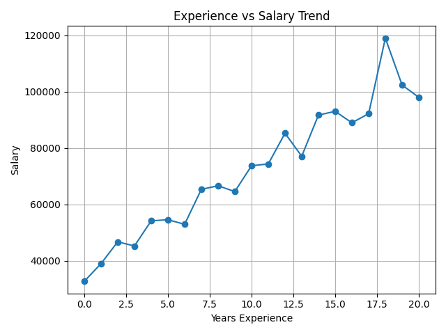

# Global Data Science Salary Analysis

## Project Overview
This project analyzes global data science salaries using Python, SQL, and data visualization techniques. 

The project includes:
- Synthetic dataset generation
- Data cleaning and preprocessing
- Exploratory Data Analysis (EDA)
- Statistical analysis
- MySQL database integration
- SQL-based analytics
- Data visualization

The goal of this project is to identify salary trends across countries, job roles, education levels, company sizes, and remote work types.

## Tools & Technologies
- Python
- Pandas
- NumPy
- Matplotlib
- Seaborn
- MySQL
- VS Code
- Jupyter Notebook
- Faker

# project structure

Global-data-science-salary-analysis/
│
├── data/
│   ├── raw_salary_dataset.csv
│   └── cleaned_salary_dataset.csv
│
├── notebooks/
│   ├── data_cleaning.ipynb
│   ├── eda_analysis.ipynb
│
├── scripts/
│   ├── generate_dataset.py
│   ├── database_connection.py
│   ├── analysis.py
│   └── visualization.py
│
├── images/
│   ├── avg_salary_country.png
│   ├── job_vs_salary.png
│   ├── experience_salary.png
│   └── remotework.png
│
├── requirements.txt
├── README.md
└── .gitignore

## Key Features

- Generated realistic synthetic salary dataset
- Performed data cleaning and preprocessing
- Handled missing values, duplicates, and outliers
- Conducted exploratory data analysis
- Performed statistical testing using T-test
- Integrated Python with MySQL database
- Executed SQL queries for analytical insights
- Created visualizations for salary trends

## Key Insights

- AI Engineers and Machine Learning Engineers received the highest average salaries.
- Remote employees earned higher average salaries compared to onsite employees.
- Large companies offered higher salaries than small companies.
- Salary increased significantly with years of experience.
- USA and Canada showed the highest salary trends.

# Images

## Visualizations

## Future Improvements
- Add machine learning salary prediction model
- Build interactive dashboard using Power BI or Streamlit
- Deploy project as web application
